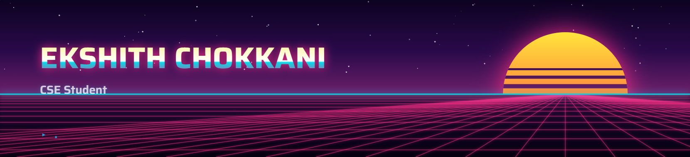

<h3 align="center">Hey 👋, I'm Ekshith</h3>

  

  
  

<table align="center">
<tr>
<td width="50%" valign="top" align="center">

<!--<h4>📊 GitHub Stats</h4>-->

</td>
<td width="50%" valign="top" align="center">

<!--<h4>📌 GitHub Overview</h4>-->

</td>
</tr>
</table>

<h4 align="center">🛠️ Tech Stack</h4>

<h4 align="center">📌 Contribution Activity</h4>

  

<table align="center" style="border:1px solid #ffffff; border-radius:10px;">
<tr>
<td width="50%" valign="top" align="center" style="border:1px solid #ffffff;">

<h5>Top Languages by Repo</h5>

</td>
<td width="50%" valign="top" align="center" style="border:1px solid #ffffff;">

<h5>Top Languages by Commit</h5>

</td>
</tr>
</table>

<!--<h4 align="center">🐍 Contribution Snake</h4> -->

  

<h4 align="center">🏆 Achievements</h4>

  

<table align="center" width="100%" border="0" cellpadding="10" cellspacing="0">
  <tr>
    <!-- Coding Profiles Block -->
    <td align="center" valign="top" width="50%">
      <h4>💻 Coding Profiles</h4>
      

        
        &nbsp;
        
        &nbsp;
        
         
        
        &nbsp;
        
        &nbsp;
        
      

    </td>
---
---
    <td align="center" valign="top" width="50%">
      <h4>🌐 Connect With Me</h4>
      

        
        &nbsp;&nbsp;
        
        &nbsp;&nbsp;
        
        &nbsp;&nbsp;
        
        &nbsp;&nbsp;
        
      

    </td>
  </tr>
</table>

  <b>"Build. Break. Learn. Repeat. 🚀"</b>

  Thanks for visiting my profile! ⭐

